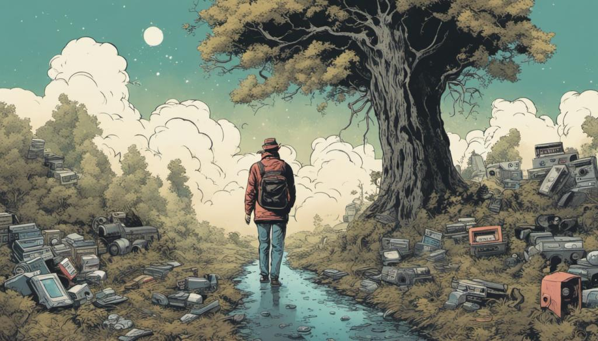

Webdit.ch - Y2K edition
---

Navigate through Web history in a series of dioramas. Scroll right and left as if you were walking in a virtual museum. Click on images to reveal an interactive exhibit or video-clip. Dive in deeper with full screen visuals. Invite the audience to contribute through an online form.

A BaselHack 2023 project by the <tt>Web Diggers</tt>

_Image generated with Stable Diffusion v1.0_

# Requirements

- [Node](https://nodejs.org)
- [Rust](https://www.rust-lang.org/)
- [Miller](https://miller.readthedocs.io) 

# Building

With `make build` you can ensure everything is installed and there are no errors.

# Running

Type `make run` to start up the frontend and backend.

See [server/README](server/README.md) and [webapp/README](webapp/README.md) for more details.

# Data

See [CONTRIBUTE](data/CONTRIBUTE.md) for tips on adding data.

Run `make refresh` to update the JSON file in the data folder.

# License

All names, logotypes, images are the property of their respective owners, and are used in this project on a "fair use" basis.

The code behind this web application is licensed with the [MIT License](LICENSE). All other contents are in the public domain.
